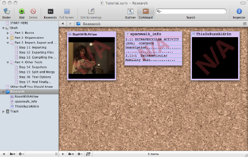
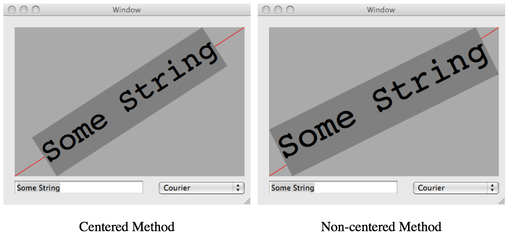

# Drawing a String Along the Diagonal of a Rectangle

Someone in the [cocoa-dev mailing list](https://lists.apple.com/mailman/listinfo/cocoa-dev) once asked for an algorithm to draw an arbitrary string along the diagonal of an arbitrary rectangle. I first solved the problem mathematically, then wrote an application illustrating the algorithm.

My algorithm was subsequently adopted by the person who asked the question, who happens to be the author of the excellent writing tool [**Scrivener**](https://www.literatureandlatte.com/scrivener.php), one screen shot of which appears below, showing where my algorithm was used.

Shortly thereafter, it occurred to me that another algorithm could be used whereby the string isn’t centered along the rectangle’s diagonal. Both versions of the algorithm are available in this repository.

Originally written on August 27, 2006.

## Creator

That would be me, _Wagner Truppel_. If you need or want to contact me, send a message to `wagner` at `restlessbrain` dot com.

## License

I'm sharing this work under the [Creative Commons Attribution-ShareAlike 4.0 International (CC BY-SA 4.0)](http://creativecommons.org/licenses/by-sa/4.0/) license. See the LICENSE file for more information.
